# 동아리 회원 관리 프로그램 (my_clubAPI)
## 22200619 / 임성열

## 1. 프로젝트 소개

### 주제
- week5_hw의 책 관리 예제를 참고해서 동아리 회원을 관리하는 프로그램 구성.
- 회원 등록, 전체 조회, 한 명 조회, 수정, 삭제가 가능하게 개발.
- 추가 기능으로 잘못된 입력을 검사하고 현재 저장된 회원 수를 확인 가능하게 개발.

### 관리하는 데이터

- Club 객체 하나에 회원 한 명의 정보를 저장.

| 필드 | 자료형 | 의미 | 예시 |
|---|---|---|---|
| `id` | `Long` | 회원 번호. 등록할 때 자동으로 생성 | `1` |
| `name` | `String` | 이름 | `홍길동` |
| `role` | `String` | 동아리에서 맡은 역할 | `회원` |
| `gender` | `String` | 성별 | `남성` |

- 이름, 역할, 성별은 반드시 입력해야 함.
- 역할과 성별은 특정 단어로 제한하지 않고, 비어 있는지만 검사.
- 데이터는 프로그램의 메모리에 저장. 서버를 종료하면 회원 정보는 사라짐.

### 프로젝트 구조

`src/main/java/org/example/db/my_clubapi`

```text
my_clubAPI/
├── README.md
├── images/
├── Dockerfile
├── .dockerignore
├── src/main/java/org/example/db/my_clubapi/
│   ├── MyClubApiApplication.java
│   ├── controller/
│   │   └── ClubController.java
│   ├── service/
│   │   └── ClubService.java
│   ├── repository/
│   │   ├── ClubRepository.java
│   │   └── MemoryClubRepository.java
│   ├── domain/
│   │   └── Club.java
│   └── dto/
│       ├── ClubRequest.java
│       └── ClubResponse.java
```

| 파일 | 각 파일별 역할                        |
|---|---------------------------------|
| `MyClubApiApplication` | 프로그램을 시작 프로그램.                  |
| `ClubController` | 요청 주소와 요청 종류를 확인하고 Service를 호출. |
| `ClubService` | 입력을 검사하고 회원 등록·조회·수정·삭제를 처리.    |
| `ClubRepository` | 저장소가 제공해야 할 메서드를 정한 인터페이스.      |
| `MemoryClubRepository` | 회원 정보를 메모리에 저장.                 |
| `Club` | 저장할 회원 정보를 담는 객체 역할.            |
| `ClubRequest` | 등록·수정 요청으로 받은 정보를 담는 역할.        |
| `ClubResponse` | 처리한 결과를 응답으로 보낼 때 사용.        |

`ClubController → ClubService → ClubRepository의 구현체인 MemoryClubRepository` 순서로 처리됨.

### 로컬 실행 방법

IntelliJ IDEA 실행 방법

1. `my_clubAPI` 폴더를 프로젝트로 열기.
2. 프로젝트 JDK를 17로 설정하고 Gradle이 필요한 라이브러리를 불러올 때까지 기다림.
3. `MyClubApiApplication.java`를 열고, `main()` 옆의 실행 버튼을 누릅니다.
4. 실행이 완료되면 Postman에서 `GET http://localhost:8080/api/clubs`를 요청합니다.

### API Endpoint 표

Endpoint는 요청을 보내는 주소. 아래 경로 앞에 `http://localhost:8080`을 붙혀서 실행.
`{id}`에는 등록 응답에서 받은 회원 번호를 넣어서 실행.

| 기능 | 요청 방식 | 경로 | 성공 결과 | 오류 결과 |
|---|---|---|---|---|
| 회원 등록 | POST | `/api/clubs` | 201, 등록한 회원 정보 | 잘못된 입력은 400 |
| 전체 회원 조회 | GET | `/api/clubs` | 200, 회원 목록 | — |
| 회원 한 명 조회 | GET | `/api/clubs/{id}` | 200, 회원 정보 | 없는 번호는 404 |
| 회원 수정 | PUT | `/api/clubs/{id}` | 200, 수정한 회원 정보 | 잘못된 입력은 400, 없는 번호는 404 |
| 회원 삭제 | DELETE | `/api/clubs/{id}` | 204, 응답 본문 없음 | 없는 번호는 404 |
| 회원 수 조회 | GET | `/api/clubs/count` | 200, 현재 회원 수 | — |

### 요청·응답 JSON 예시
Postman에서 `POST`와 `http://localhost:8080/api/clubs`를 선택하고,
`Body → raw → JSON`에 다음 내용을 넣음. `id`는 서버에서 만들기 때문에 요청에는 넣지 않음.

```json
{
  "name": "홍길동",
  "role": "회원",
  "gender": "남성"
}
```

등록 응답은 `201 Created`.

```json
{
  "id": 1,
  "name": "홍길동",
  "role": "회원",
  "gender": "남성"
}
```

이 상태에서 `GET /api/clubs`를 요청하면 목록이 반환.

```json
[
  {
    "id": 1,
    "name": "홍길동",
    "role": "회원",
    "gender": "남성"
  }
]
```

`GET /api/clubs/1`은 위 목록 안의 회원 객체 하나를 반환.
`GET /api/clubs/count`의 응답은 다음처럼 숫자만 나옴.

```json
1
```

수정할 때는 `PUT /api/clubs/1`에 다음 JSON을 보냄.
```json
{
  "name": "김유리",
  "role": "회장",
  "gender": "여성"
}
```

수정 응답은 `200 OK`이며 번호는 그대로 유지.

```json
{
  "id": 1,
  "name": "김유리",
  "role": "회장",
  "gender": "여성"
}
```

### 저장소와 배포 주소

| 구분 | 현재 상태 |
|---|---|
| GitHub Repository URL | 개인 저장소: https://github.com/SungyulLim/WSD_assign05-c01-22200619 |
| GitHub Repository URL | 저장소: https://github.com/2026-2-WebService/assign05-c01-22200619.git |
| 배포 URL | https://wsd-assign05-c01-22200619.onrender.com/api/clubs |
| 로컬 확인 주소 | `http://localhost:8080/api/clubs` |

## 2. 개발환경 및 Dependency

### 개발환경

| 항목 | 사용 환경                                 |
|---|---------------------------------------|
| IDE | IntelliJ IDEA 프로젝트 사용                 |
| JDK | 프로젝트·빌드 설정 Java 17                    |
| Spring Boot | 3.5.5                                 |
| Build Tool | Gradle 9.0.0, 프로젝트의 Gradle Wrapper 사용 |
| 데이터 저장 | `LinkedHashMap<Long, Club>`           |
| 요청 테스트 | Postman                               |
| 배포 환경 | Render                                |

### 사용한 Dependency와 이유

Dependency는 프로젝트에서 가져다 쓰는 라이브러리.
프로젝트를 만들 때 기능으로 선택한 항목은 **Spring Web**.

| 직접 선택한 항목 | build.gradle에 적힌 이름 | 이 프로젝트에서 필요한 이유 |
|---|---|---|
| Spring Web | `spring-boot-starter-web` | 회원 등록·조회·수정·삭제 HTTP 요청을 받고, 회원 정보를 JSON으로 응답하는 REST API를 만들기 위해 사용. |

Spring Boot 버전은 원본에 맞춰 3.5.5로 설정.

## 3. Solution 분석
### Q1. 등록 요청은 어떤 순서로 처리되는가?

`BookController.create()`가 요청을 받고 `BookService.create()`를 호출.
Service는 `Book`을 만들어 `MemoryBookRepository.save()`로 저장.
저장한 객체는 `toResponse()`에서 응답용 객체로 바뀜.
동아리 프로젝트도 같은 순서이며, 저장 전에 입력 검사만 추가함.

관련 코드: `ClubController.create()`, `ClubService.create()`, `MemoryClubRepository.save()`, `ClubService.toResponse()`

### Q2. 회원 번호는 어디서 만들어지는가?

원본의 `MemoryBookRepository.save()`에서 `++sequence`로 번호를 1씩 증가시킴.
이번 프로젝트도 같은 방법으로 번호를 만들고 `setId()`로 회원 객체에 넣음.

관련 코드: `MemoryClubRepository.save()`, `Club.setId()`

### Q3. Request, 저장 객체, Response를 나누는 이유는?

`BookRequest`는 받은 정보, `Book`은 저장할 정보, `BookResponse`는 보낼 정보를 담는다.
이번 프로젝트의 `ClubRequest`에는 이름·역할·성별만 있고,
`Club`과 `ClubResponse`에는 서버가 만든 회원 번호도 있음.
각 객체가 맡은 역할을 구분하기 위해 나눔.

관련 코드: `ClubRequest`, `Club`, `ClubResponse`, `ClubService.toResponse()`

### Q4. Service는 왜 Repository 인터페이스를 사용하는가?

원본의 `BookService`는 생성자로 `BookRepository`를 받음.
저장 방법의 세부 내용은 `MemoryBookRepository`에 맡기고, Service에서는 정해진 메서드를 호출.
이번 프로젝트도 `ClubRepository` 인터페이스를 생성자로 받으며,
실제로 저장하는 객체는 `MemoryClubRepository`.

관련 코드: `ClubService(ClubRepository repository)`, `ClubRepository`, `MemoryClubRepository`

### Q5. 없는 번호를 조회하면 어떻게 404가 나오는가?

원본의 `findBook()`은 저장소에서 받은 결과가 비어 있으면
`orElseThrow()`로 `ResponseStatusException`을 발생시킴.
이때 `HttpStatus.NOT_FOUND`를 사용해서 404 응답이 됨.
회원 조회도 같은 방식으로 처리.

관련 코드: `ClubService.findClub()`, `MemoryClubRepository.findById()`

## 4. 개발 과정 요약

| 단계 | 만든 내용 또는 변경한 내용 | 관련 클래스·메서드 | 확인 방법 |
|---|---|---|---|
| 1. 원본 확인과 실행 설정 | 책 관리 예제의 파일 역할을 확인하고 Spring Boot·Gradle·Java 설정을 맞춤 | `build.gradle`, Wrapper 설정, `MyClubApiApplication.main()` | 빌드와 기존 `contextLoads()` 테스트 통과 |
| 2. 회원 정보와 DTO 작성 | 제목·저자·가격을 이름·역할·성별로 바꿈. 성별은 문자열로 변경 | `Club` 생성자·getter/setter, `ClubRequest`, `ClubResponse` | 컴파일 확인, 등록 응답에 회원 필드가 나오는지 확인 |
| 3. 기본 CRUD 작성 | 원본과 같은 방식으로 등록·조회·수정·삭제 구현 | `ClubController`, `ClubService`, `ClubRepository`, `MemoryClubRepository`의 CRUD 메서드 | 실제 HTTP 요청으로 등록부터 삭제 후 404까지 확인 |
| 4. 추가 기능 작성 | 빈 값 검사와 회원 수 조회 추가 | `ClubService.validate()`, `create()`, `update()`, `count()`, `ClubController.count()` | 잘못된 입력의 400, 실패한 수정 후 정보 유지, 회원 수 변화 확인 |
| 5. 최종 확인과 문서 작성 | 실행 JAR 생성, 테스트 결과와 사용 방법 정리 | `MyClubApiApplicationTests.contextLoads()`, `README.md` | 기존 테스트와 curl 요청 45건 통과 기록 확인 |

### 원본에서 바뀐 부분

| 원본 | 변경 후 |
|---|---|
| `Book` 및 `Book...` 클래스 | `Club` 및 `Club...` 클래스 |
| `String title` | `String name` |
| `String author` | `String role` |
| `int price` | `String gender` |
| `/api/books` | `/api/clubs` |
| `com.webservice.week04` | `org.example.db.my_clubapi` |
| `Week04BookCrudApplication` | `MyClubApiApplication` |

Controller, Service, Repository를 나누는 구조와 생성자 주입, `record` DTO,
getter/setter, `LinkedHashMap`, `Optional`, Stream, 예외 처리 방식은 유지.
추가 과제를 위해 `if`, `== null`, `||`, `isBlank()`, `size()` 등의 표현은 새로 사용.

## 5. 기능 수정·확장

### A. 잘못된 입력 처리

**추가한 이유:** 이름이나 역할 등이 비어 있는 회원 정보가 저장되는 것을 막기 위함.

**수정한 코드:** `ClubService.validate()`를 만들고 `create()`와 `update()`에서 호출.
`name`, `role`, `gender`가 누락되거나 `null`, `""`, 공백만 있는 문자열이면
원본에서 사용한 `ResponseStatusException`에 `HttpStatus.BAD_REQUEST`를 넣어 400을 반환.


아래 표는 앞서 AI가 curl로 확인한 로컬 테스트 기록입니다. 이번 Postman 테스트의 실제 화면은 아래 **실제 응답 결과 — Postman 캡처**에 첨부합니다.

| 테스트 요청 | 요청 내용 | 예상 결과 | 기존 로컬 테스트 결과 |
|---|---|---|---|
| `POST /api/clubs` | `{"name":"홍길동","role":"회원","gender":"남성"}` | 201, 회원 등록 | 201, 번호 1과 입력한 회원 정보 반환 |
| `PUT /api/clubs/1` | `{"name":"이서연","role":"회장","gender":"여성"}` | 200, 정보 수정 | 200, 번호 1 유지 및 세 필드 변경 |
| `POST /api/clubs` | `{"name":"   ","role":"회원","gender":"남성"}` | 400, 등록 안 됨 | 400, 회원 수 유지 |
| `PUT /api/clubs/1` | `{"name":"홍길동","role":"","gender":"남성"}` | 400, 수정 안 됨 | 400, 기존 회원 정보 유지 |
| 등록·수정 요청 | 각 필드를 누락·null·빈 문자열·공백으로 바꿔서 요청 | 모두 400 | 3개 필드 × 4가지 경우 × 등록·수정 = 24건 모두 400 |

### B. 현재 저장된 회원 수 조회

**추가한 이유:** 회원 목록을 직접 세지 않고 현재 몇 명이 저장되어 있는지 확인하기 위함.

**수정한 코드:** `ClubController.count()`와 `ClubService.count()`를 추가함.
Service에서 기존 `repository.findAll()`로 목록을 가져오고 `size()`로 개수를 반환함.

**요청 조건:** `GET /api/clubs/count`를 호출. 요청 본문이나 검색어는 필요하지 않음.

아래 표는 앞서 회원 두 명으로 확인한 로컬 테스트 기록입니다. 아래 Postman 캡처 순서에서는 회원 한 명을 등록하고 삭제하여 회원 수를 비교합니다.

| 테스트 시점 | 예상 결과 | 기존 로컬 응답 상태 | 기존 로컬 응답 본문 |
|---|---|---|---|
| 서버 시작 직후 | 0명 | 200 | `0` |
| 회원 두 명 등록 후 | 2명 | 200 | `2` |
| 잘못된 등록 요청 후 | 2명 유지 | 200 | `2` |
| 한 명 삭제 후 | 1명 | 200 | `1` |
| 남은 회원 삭제 후 | 0명 | 200 | `0` |

### 실제 응답 결과 — Postman 캡처

아래 13단계를 순서대로 실행하고, 각 단계의 실제 응답 화면을 캡처해 첨부합니다.
예상 결과는 확인 기준이며, 실제 결과는 각 항목 아래에 넣는 캡처로 기록합니다.

#### 캡처 넣는 방법

1. Postman에서 아래의 요청 방식과 주소를 입력합니다. POST·PUT은 `Body → raw → JSON`, GET·DELETE는 `Body → none`을 선택합니다.
2. `Send`를 누른 뒤 요청 방식·주소·요청 JSON·응답 상태·응답 본문이 보이도록 캡처합니다.
3. 캡처를 아래 표의 파일명으로 바꾸고, 이 README와 같은 폴더에 있는 `images` 폴더에 저장합니다.
4. 이미지 연결 코드는 이미 작성되어 있으므로 파일만 넣으면 README 미리보기와 GitHub에 표시됩니다. README와 이미지 파일을 함께 Commit·Push합니다.

> 파일명과 `.png` 확장자를 표와 똑같이 맞춰 주세요. 이미지를 넣기 전에는 이미지가 표시되지 않습니다.
> 아래 URL의 `/1`은 예시입니다. 2단계 등록 응답에서 받은 실제 `id`로 바꿔 요청하세요.
> 수정 예시는 이 README의 요청 예시와 동일한 `김유리`를 사용합니다.
> 테스트 중 추가 등록이나 서버 재시작이 없다는 기준으로 회원 수를 비교합니다. 재시작으로 데이터가 사라지면 1단계부터 다시 진행합니다.

| 단계 | 캡처할 내용 | images 폴더에 저장할 파일명 |
|---|---|---|
| 01 | 등록 전 회원 수 확인 | `01-count-before.png` |
| 02 | 정상 회원 등록 | `02-post-success.png` |
| 03 | 전체 회원 조회 | `03-get-members.png` |
| 04 | 회원 한 명 조회 | `04-get-member.png` |
| 05 | 정상 회원 수정 | `05-put-success.png` |
| 06 | 수정 결과 다시 조회 | `06-get-after-update.png` |
| 07 | 잘못된 등록 요청 | `07-post-invalid.png` |
| 08 | 잘못된 수정 요청 | `08-put-invalid.png` |
| 09 | 잘못된 수정 후 기존 정보 확인 | `09-get-after-invalid-update.png` |
| 10 | 등록 후 회원 수 확인 | `10-count-after-create.png` |
| 11 | 회원 삭제 | `11-delete-success.png` |
| 12 | 삭제한 회원 조회 | `12-get-deleted-member.png` |
| 13 | 삭제 후 회원 수 확인 | `13-count-after-delete.png` |

#### 01. 등록 전 회원 수 확인

**요청 방식:** `GET`

**요청 주소:**

```text
https://wsd-assign05-c01-22200619.onrender.com/api/clubs/count
```

**Body:** `none` (입력하지 않음)

**예상 결과:** 200 OK. 현재 회원 수를 확인합니다. 회원이 없다면 0.

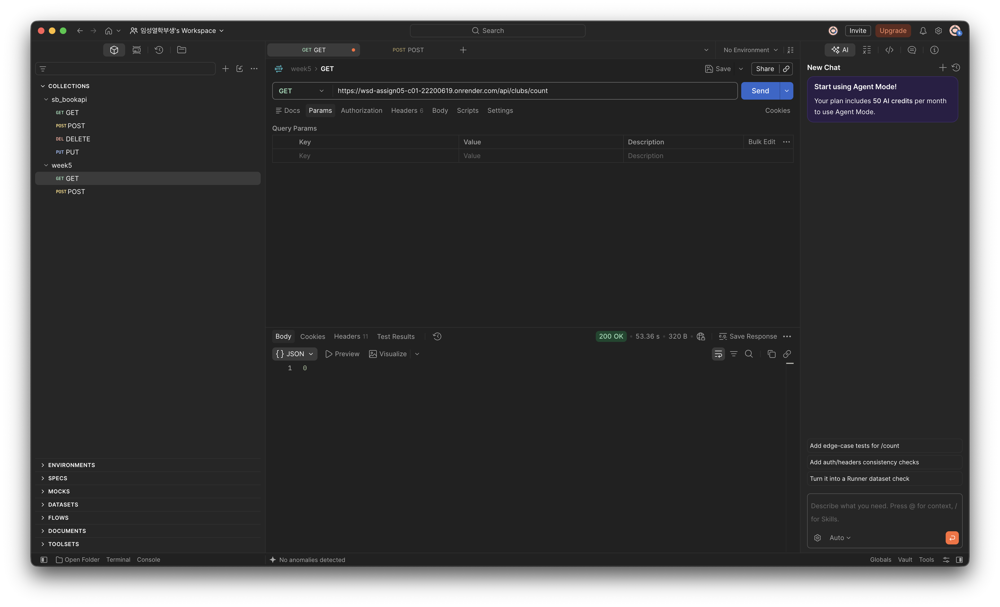

#### 02. 정상 회원 등록

**요청 방식:** `POST`

**요청 주소:**

```text
https://wsd-assign05-c01-22200619.onrender.com/api/clubs
```

**Body → raw → JSON:**

```json
{
  "name": "홍길동",
  "role": "회원",
  "gender": "남성"
}
```

**예상 결과:** 201 Created. 회원 번호와 입력한 정보가 반환. 응답의 id를 다음 단계부터 사용.

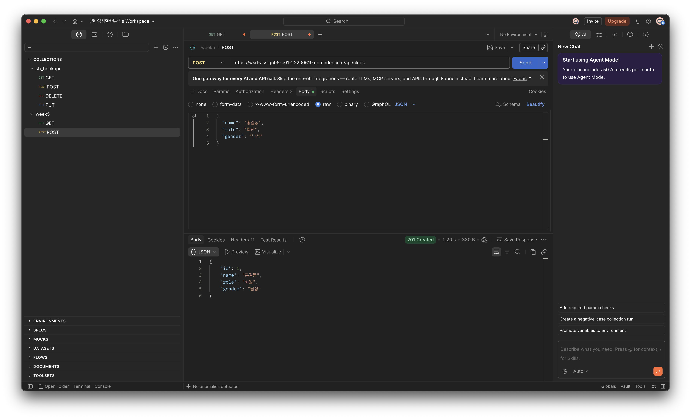

#### 03. 전체 회원 조회

**요청 방식:** `GET`

**요청 주소:**

```text
https://wsd-assign05-c01-22200619.onrender.com/api/clubs
```

**Body:** `none` (입력하지 않음)

**예상 결과:** 200 OK. 목록에 방금 등록한 홍길동이 포함됨.

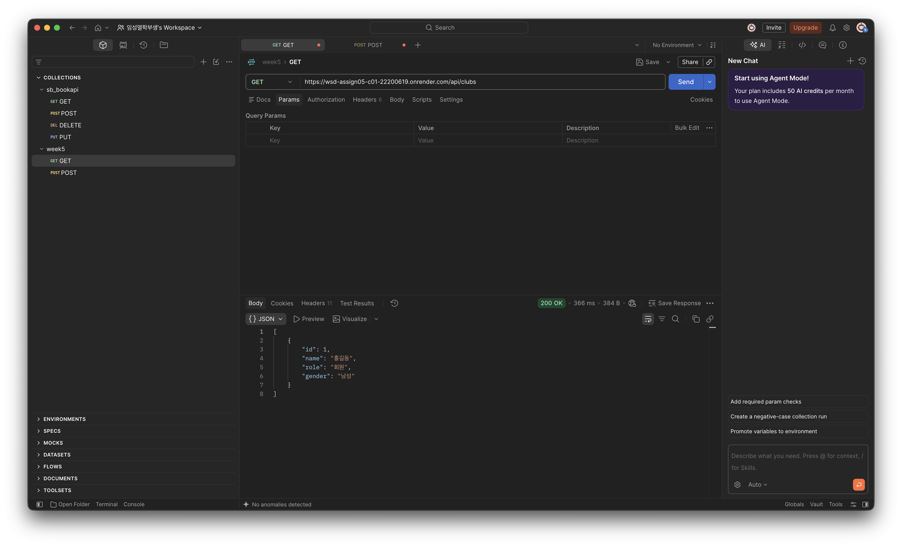

#### 04. 회원 한 명 조회

**요청 방식:** `GET`

**요청 주소:**

```text
https://wsd-assign05-c01-22200619.onrender.com/api/clubs/1
```

**Body:** `none`

**예상 결과:** 200 OK. 2단계에서 등록한 회원의 정보가 반환됨.

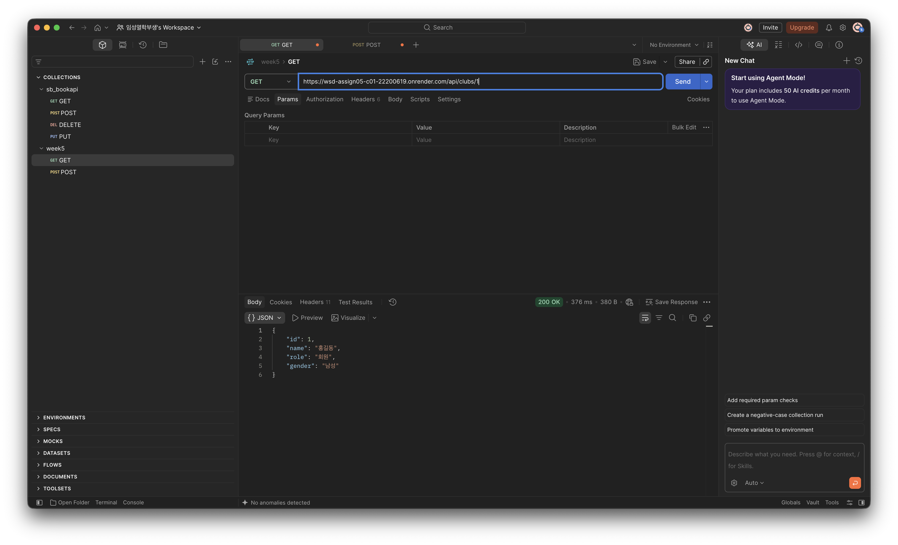

#### 05. 정상 회원 수정

**요청 방식:** `PUT`

**요청 주소:**

```text
https://wsd-assign05-c01-22200619.onrender.com/api/clubs/1
```

**Body → raw → JSON:**

```json
{
  "name": "김유리",
  "role": "회장",
  "gender": "여성"
}
```

**예상 결과:** 200 OK. 회원 번호는 그대로이고 이름·역할·성별이 김유리 / 회장 / 여성으로 변경됨.

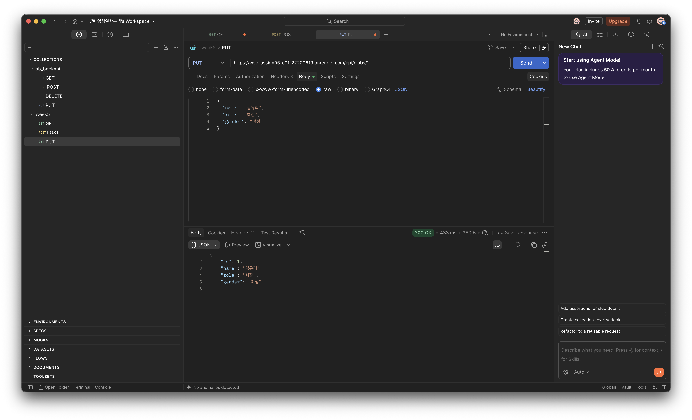

#### 06. 수정 결과 다시 조회

**요청 방식:** `GET`

**요청 주소:**

```text
https://wsd-assign05-c01-22200619.onrender.com/api/clubs/1
```

**Body:** `none` (입력하지 않음)

**예상 결과:** 200 OK. 김유리 / 회장 / 여성으로 수정된 정보가 유지됨.

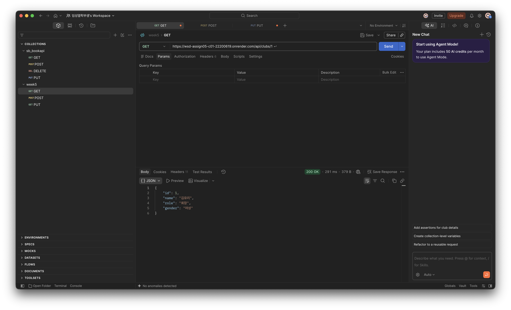

#### 07. 잘못된 등록 요청

**요청 방식:** `POST`

**요청 주소:**

```text
https://wsd-assign05-c01-22200619.onrender.com/api/clubs
```

**Body → raw → JSON:**

```json
{
  "name": "",
  "role": "회원",
  "gender": "남성"
}
```

**예상 결과:** 400 Bad Request. 이름이 빈 문자열이므로 회원이 등록되지 않음.

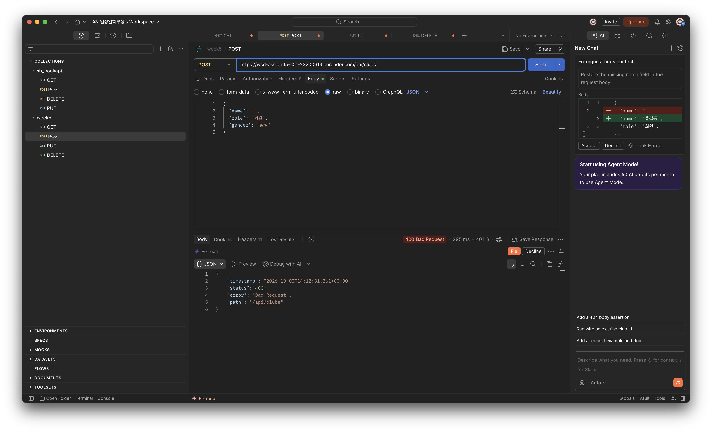

#### 08. 잘못된 수정 요청

**요청 방식:** `PUT`

**요청 주소:**

```text
https://wsd-assign05-c01-22200619.onrender.com/api/clubs/1
```

**Body → raw → JSON:**

```json
{
  "name": "김민수",
  "role": "",
  "gender": "남성"
}
```

**예상 결과:** 400 Bad Request. 역할이 빈 문자열이므로 회원 정보가 수정되지 않음.

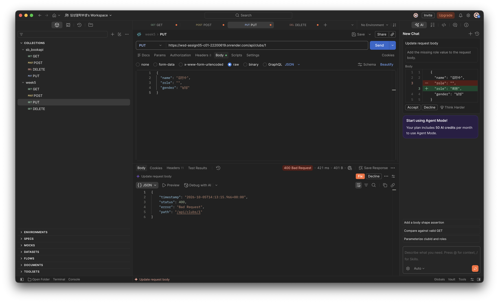

#### 09. 잘못된 수정 후 기존 정보 확인

**요청 방식:** `GET`

**요청 주소:**

```text
https://wsd-assign05-c01-22200619.onrender.com/api/clubs/1
```

**Body:** `none` (입력하지 않음)

**예상 결과:** 200 OK. 김민수로 바뀌지 않고 김유리 / 회장 / 여성 정보가 유지.


#### 10. 등록 후 회원 수 확인

**요청 방식:** `GET`

**요청 주소:**

```text
https://wsd-assign05-c01-22200619.onrender.com/api/clubs/count
```

**Body:** `none` (입력하지 않음)

**예상 결과:** 200 OK. 1단계보다 1명 증가한 숫자가 반환됨. 실패한 등록 요청은 회원 수를 늘리지 않음.


#### 11. 회원 삭제

**요청 방식:** `DELETE`

**요청 주소:**

```text
https://wsd-assign05-c01-22200619.onrender.com/api/clubs/1
```

**Body:** `none` (입력하지 않음)

**예상 결과:** 204 No Content. 응답 본문은 비어있음.

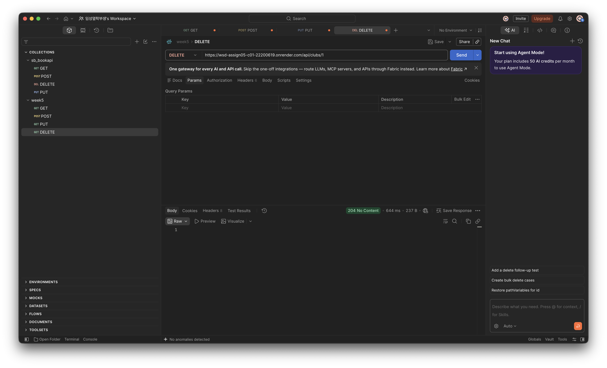

#### 12. 삭제한 회원 조회

**요청 방식:** `GET`

**요청 주소:**

```text
https://wsd-assign05-c01-22200619.onrender.com/api/clubs/1
```

**Body:** `none` (입력하지 않음)

**예상 결과:** 404 Not Found.

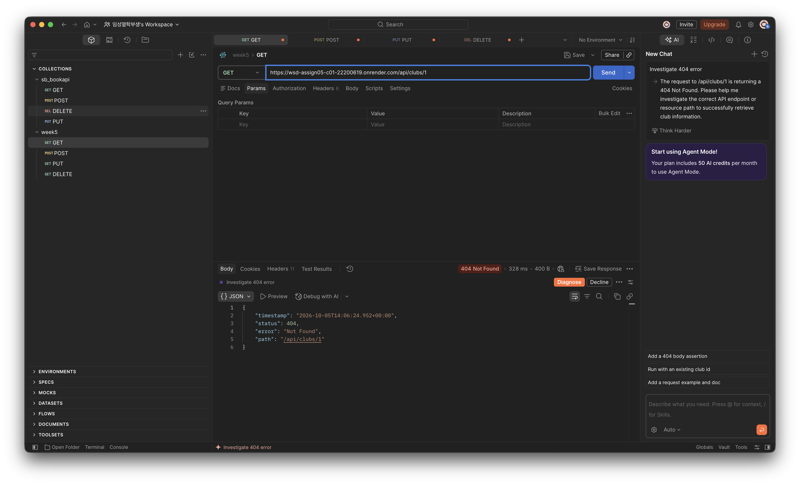

#### 13. 삭제 후 회원 수 확인

**요청 방식:** `GET`

**요청 주소:**

```text
https://wsd-assign05-c01-22200619.onrender.com/api/clubs/count
```

**Body:** `none` (입력하지 않음)

**예상 결과:** 200 OK. 10단계보다 1명 감소하여 1단계와 같은 수가 됨. 처음이 0명이었다면 다시 0명임.

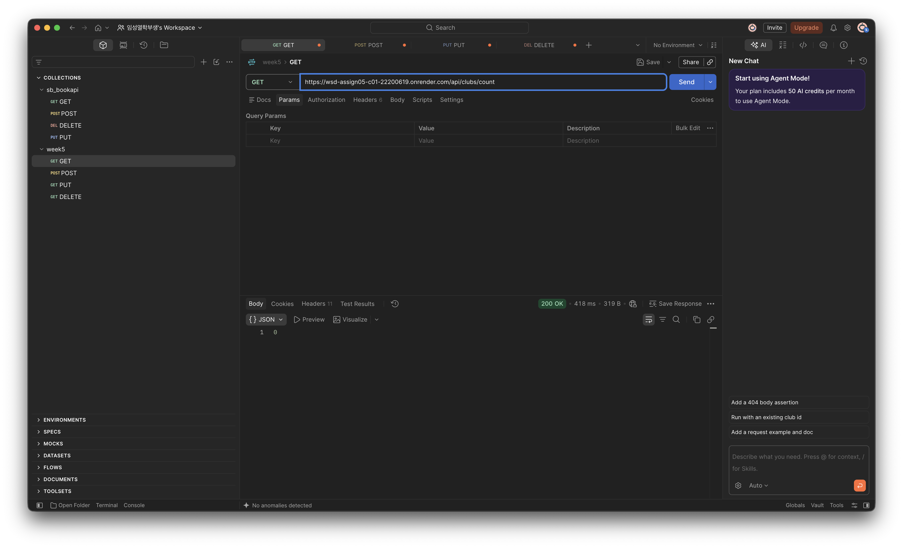


## 6. 배포 과정 요약

동아리 회원 관리 프로그램을 GitHub에 올린 뒤 Render의 Docker 방식으로 배포.
배포된 주소에 Postman으로 요청을 보내 회원 등록·조회·수정·삭제와 회원 수 조회를 확인.

- GitHub 저장소: [WSD_assign05-c01-22200619](https://github.com/SungyulLim/WSD_assign05-c01-22200619)
- 서버 주소: https://wsd-assign05-c01-22200619.onrender.com
- 회원 관리 API: https://wsd-assign05-c01-22200619.onrender.com/api/clubs

### 1. 수행한 빌드 및 배포 순서

1. `my_clubAPI` 폴더에서 `build.gradle`과 같은 위치에 `Dockerfile`을 작성. Gradle 설정과 소스 코드를 복사하고 Java 17로 빌드하도록 함.
2. Dockerfile을 포함한 프로젝트 코드를 GitHub 저장소에 올림.
3. Render에서 `New → Web Service`를 선택하고 GitHub 저장소를 연결. 실행 환경은 `Docker`, 인스턴스는 `Free`로 설정.
4. 배포를 시작하자 Render가 Dockerfile을 읽고 `./gradlew clean bootJar --no-daemon`을 실행하여 실행 JAR을 만들었음.
5. Dockerfile의 실행 단계에서 생성된 JAR을 `app.jar`로 복사하고 `java -jar app.jar`로 서버를 실행.
6. Render 로그에서 `Started MyClubApiApplication`과 `Tomcat started on port 8080`을 확인. 이후 Render가 8080 포트를 감지하고 연결 설정을 적용하기 위해 자동으로 재시작.
7. 배포 주소를 Postman에 입력하고 API 요청을 보냄.

### 2. 배포를 위해 추가하거나 수정한 파일·설정

| 파일 | 추가하거나 수정한 내용 | 필요한 이유 |
|---|---|---|
| `Dockerfile` | Java 17 JDK로 빌드하고 Java 17 JRE로 실행하는 두 단계 구성 | Render에서 프로젝트를 빌드하고 실행할 Java 환경을 준비하기 위해 사용 |
| `Dockerfile`의 실행 권한 설정 | `RUN chmod +x gradlew` | Render의 Linux 환경에서 Gradle Wrapper를 실행할 수 있게 설정 |
| `Dockerfile`의 빌드 명령 | `RUN ./gradlew clean bootJar --no-daemon` | 기존 빌드 결과를 정리하고 실행 가능한 JAR 생성 |
| `Dockerfile`의 실행 명령 | `ENTRYPOINT ["java", "-jar", "app.jar"]` | 컨테이너가 시작될 때 회원 관리 프로그램 실행 |
| `.dockerignore` | `.git`, `.gradle`, `.idea`, `build`, `out` 등 제외 | 로컬 설정과 기존 빌드 결과가 Docker 빌드에 불필요하게 포함되지 않도록 설정 |
| `src/main/resources/application.properties` | 현재 로컬 파일에 `server.port=${PORT:8080}`와 `server.address=0.0.0.0` 설정 | 지정된 PORT가 있으면 사용하고 없으면 8080으로 실행하며, 외부 요청을 받을 수 있게 설정 |

### 3. 배포 및 배포 후 확인 중 발생한 문제와 해결 방법

#### 문제 1. 서버가 시작된 뒤에도 배포가 진행 중으로 표시됨

`Started MyClubApiApplication`이 출력된 뒤에도 Render의 상태가 `In progress`로 표시됨.
로그를 확인하니 `Detected a new open port HTTP:8080`과
`New primary port detected: 8080. Restarting deploy to update network configuration...`이 나옴.

=> 

Render가 실행 중인 서버의 8080 포트를 감지한 뒤 연결 설정을 적용하는 과정.
자동 재시작이 끝난 뒤 배포 주소로 Postman 요청을 보내 정상 응답을 확인.

#### 문제 2. Postman에서 회원 수 조회 시 400 오류 발생

`GET /api/clubs/count`를 요청했지만 `400 Bad Request`가 나옴.
응답의 `path`를 확인하니 `/api/clubs/count%0A`로 표시됨.
주소를 복사할 때 끝에 줄바꿈이 함께 들어간 것이 원인.

주소 입력칸을 비우고 줄바꿈 없이 주소를 다시 입력한 뒤 `Send'.
수정 후 `200 OK`와 회원 수 `1`이 반환되는 것을 확인.
결과는 [10번 회원 수 조회 캡처](images/10-count-after-create.png)에 첨부.

### 4. 배포 URL로 확인한 요청과 응답

`https://wsd-assign05-c01-22200619.onrender.com`.
결과는 `images` 폴더에 저장한 실제 Postman 캡처를 기준으로 정리.

| 확인한 내용 | 요청 | 실제 응답 | 캡처 |
|---|---|---|---|
| 등록 전 회원 수 | `GET /api/clubs/count` | 200 OK, `0` | [01](images/01-count-before.png) |
| 회원 등록 | `POST /api/clubs` | 201 Created, `id: 1`, 홍길동 / 회원 / 남성 | [02](images/02-post-success.png) |
| 전체 회원 조회 | `GET /api/clubs` | 200 OK, 등록한 홍길동이 포함된 목록 | [03](images/03-get-members.png) |
| 회원 한 명 조회 | `GET /api/clubs/1` | 200 OK, 번호 1의 회원 정보 | [04](images/04-get-member.png) |
| 회원 수정 | `PUT /api/clubs/1` | 200 OK, 김유리 / 회장 / 여성으로 변경 | [05](images/05-put-success.png) |
| 수정 결과 재조회 | `GET /api/clubs/1` | 200 OK, 김유리 / 회장 / 여성 정보 확인 | [09](images/09-get-after-invalid-update.png) |
| 잘못된 등록 주소 | `POST /api/clubs%0A` | 404 Not Found. 빈 이름 검사는 재확인 필요 | [07](images/07-post-invalid.png) |
| 잘못된 수정 주소 | `PUT /api/clubs/1%0A` | 400 Bad Request. 빈 역할 검사는 재확인 필요 | [08](images/08-put-invalid.png) |
| 등록 후 회원 수 | `GET /api/clubs/count` | 200 OK, `1` | [10](images/10-count-after-create.png) |
| 회원 삭제 | `DELETE /api/clubs/1` | 204 No Content, 응답 본문 없음 | [11](images/11-delete-success.png) |
| 삭제한 회원 조회 | `GET /api/clubs/1` | 404 Not Found | [12](images/12-get-deleted-member.png) |
| 삭제 후 회원 수 | `GET /api/clubs/count` | 200 OK, `0` | [13](images/13-count-after-delete.png) |


## 7. Weekly Report

### Key Learning: 이번 코드에서 정리한 내용 3가지

1. **파일마다 역할이 다름.** Controller는 요청을 받고, Service는 처리 순서를 정하고, Repository는 데이터를 저장.
2. **요청 데이터/응답 데이터.** 등록 요청에는 이름·역할·성별을 보내지만, 응답에는 자동으로 만든 회원 번호도 들어감.
3. **수정하기 전에 검사.** `update()`에서 먼저 `validate()`를 호출해야 잘못된 입력이 기존 회원 정보를 바꾸는 일을 막을 수 있음.

### Problem & Solution: 자료형 변경 후 컴파일 오류

가격을 뜻하는 `int price`를 성별을 뜻하는 `String gender`로 바꾸는 과정에서,
처음에는 `getGender()`의 반환형이 `int`로 남아 있었음.
문자열을 반환하는 메서드가 정수를 반환한다고 선언되어 있어 컴파일 오류가 발생.

`Club.getGender()`의 반환형을 `String`으로 수정함.
그다음 `ClubRequest`, `ClubResponse`, 생성자와 setter에서도 성별을 `String`으로 사용하는지 확인.

### Code Review: `ClubService.update()`

회원 정보를 수정하는 매서드.

```java
public ClubResponse update(Long id, ClubRequest r) {
    validate(r);
    Club b = findClub(id);
    b.setName(r.name());
    b.setRole(r.role());
    b.setGender(r.gender());
    return toResponse(repository.update(b));
}
```

1. `validate(r)`에서 입력을 검사. 잘못된 입력이면 400을 반환하고 처리를 멈춤.
2. `findClub(id)`로 수정할 회원을 찾음. 회원이 없으면 404를 반환.
3. 회원을 찾으면 setter로 이름, 역할, 성별을 바꿈.
4. `repository.update(b)`로 저장소에 반영.
5. `toResponse()`로 응답용 객체를 만들어 반환.

### AI Usage

- **AI에 요청한 내용:** render 연결 방법, validate() 사용 방법 공부
- **참고한 답변과 코드:** `ResponseStatusException`을 이용한 400 처리

```java
private void validate(ClubRequest r) {
    if (r.name() == null || r.name().isBlank()) {
        throw new ResponseStatusException(HttpStatus.BAD_REQUEST, "Name is required");
    }
    if (r.role() == null || r.role().isBlank()) {
        throw new ResponseStatusException(HttpStatus.BAD_REQUEST, "Role is required");
    }
    if (r.gender() == null || r.gender().isBlank()) {
        throw new ResponseStatusException(HttpStatus.BAD_REQUEST, "Gender is required");
    }
}
```

`ClubService`에서 사용하는 입력 검사 코드. 이름·역할·성별이 `null`이거나 빈 문자열 또는 공백뿐이면
`ResponseStatusException`을 발생시켜 `400 Bad Request`를 반환함.
등록·수정 전에 `validate()`를 호출하여 잘못된 정보가 저장되지 않도록 처리함.

### Reflection: 더 공부하고 싶은 내용
- 현재는 서버를 종료하면 회원 정보가 사라짐. 다음에는 데이터를 파일이나 데이터베이스에 저장하는 방법을 공부하고 싶습니다.
